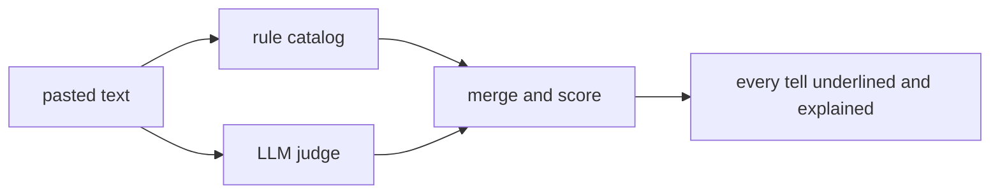

<p align="center">
  
</p>

<h1 align="center">isitslop</h1>

<p align="center">Catch it before it's too late.</p>

The slop research of the world, scoured and turned into one running rule catalog: the excess-vocabulary studies (Kobak, Liang, Juzek and Ward), the register study (Reinhart), Wikipedia's editor-kept catalog of AI signs, the public write-ups of GPTZero, Pangram and Originality, and more as it lands. Paste a text, in English or Spanish, and the parrot runs all of it.

## How it works



## The sources

What each one contributed to the catalog:

- [Kobak et al., Science Advances 2025](https://arxiv.org/abs/2406.07016) measured excess vocabulary across 15 million PubMed abstracts and isolated the words that language models overuse. The heaviest hitters are in the word lists.
- [Liang et al., ICML 2024](https://arxiv.org/abs/2403.07183) traced AI-modified text in peer review at population scale, with per-word multipliers up to 35x. Those words are in the lists too.
- [Juzek and Ward, COLING 2025](https://aclanthology.org/2025.coling-main.426/) found why models lean on certain words: the preference-tuning data rewards them.
- [Reinhart et al., PNAS 2025](https://arxiv.org/abs/2410.16107) measured the register itself: models stack nominalizations at twice the human rate and participial clauses at up to five times. Texts of 400 words or more get checked for both, against human baselines: under twice the human rate, nothing is said, and past it the flag tells you your multiple.
- [Wikipedia's catalog of AI writing signs](https://en.wikipedia.org/wiki/Wikipedia:Signs_of_AI_writing), kept by the editors who clean it up every day. The structural tells (label headings, formula closers, bolted-on comment clauses) come from here.
- Public write-ups from commercial detectors (GPTZero, Pangram, Originality) for the statistical signals, like sentence-rhythm variance.

All of it is readable code: the [word lists](src/lib/rules/), the [pattern rules](src/lib/scanners/deterministic.ts), the [LLM prompts](src/lib/scanners/llm.ts) and the [scoring](src/lib/scanners/merge.ts).

## Run it

```bash
npm install
cp .env.example .env   # GOOGLE_GENAI_API_KEY turns on the LLM judge (optional)
npm run dev            # http://localhost:5173
npm test               # one of these tests scans this README for slop
```

The rule catalog always runs, with or without a key. The endpoint rate-limits by IP and rejects junk before spending tokens ([src/lib/server/](src/lib/server/)).

## Stack

SvelteKit 2, Svelte 5, TypeScript, Tailwind 4, Gemini. MIT license.
