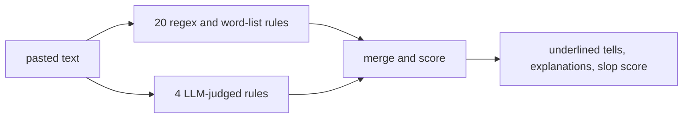

<p align="center">
  
</p>

<h1 align="center">isitslop</h1>

<p align="center">Catch it before it's too late.</p>

Paste up to 1000 words, in English or Spanish. The parrot underlines every AI tell it finds, names the rule that caught it, and gives the text a slop score from 0 to 100.

## What it does

- Underlines 24 kinds of AI tells and explains each one in place
- Works in English and Spanish, with auto-detection
- Scores with judgment: one stray tell in a long text counts for nothing
- Keeps nothing: no accounts, no history, no stored text

## How it works



The rules are the product, and all of them are readable. The word lists come from published studies of words that language models overuse (Kobak et al. 2025, Liang et al. 2024, Juzek and Ward 2025) and from Wikipedia's catalog of AI writing signs. See the [word lists](src/lib/rules/), the [regex rules](src/lib/scanners/deterministic.ts), the [LLM prompts](src/lib/scanners/llm.ts) and the [scoring](src/lib/scanners/merge.ts).

## The score

Repeating one tell compounds. Mixing different tells weighs more than repeating one. Tells that cluster in a single passage count more than the same tells spread across the page. A lone soft tell in a long text scores zero, while pasted chat artifacts guarantee at least 25. A rhythm meter also shows how much your sentence lengths vary, since model text tends to keep one beat.

## Run it

```bash
npm install
cp .env.example .env   # GOOGLE_GENAI_API_KEY turns on the LLM rules (optional)
npm run dev            # http://localhost:5173
npm test               # one of these tests scans this README for slop
```

The regex rules always run, with or without a key. The endpoint rate-limits by IP and rejects junk before spending tokens ([src/lib/server/](src/lib/server/)).

## Stack

SvelteKit 2, Svelte 5, TypeScript, Tailwind 4, Gemini. MIT license.
